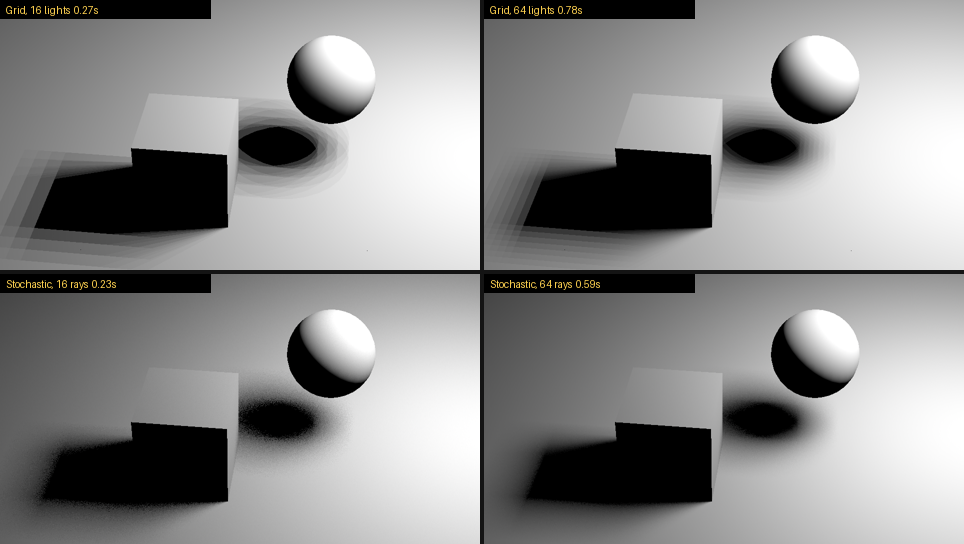

# SoftBox

**Soft shadow area light for Nuke 17 ScanlineRender2**

By Marten Blumen

  

---

ScanlineRender2's built-in lights only cast hard shadows: they send one shadow ray to the centre of the light. SoftBox adds an **AreaLight** node plus a ScanlineRender2 light shader, `slrRectLight`, that samples shadow rays across the whole light surface the way a path tracer does. The result is a smooth, physically based penumbra from a single light, and it is faster than faking one with a grid of lights.



*Top: v1.1 grid of hard-shadow lights (the penumbra is built from stepped copies). Bottom: v1.2 stochastic sampling. 960x540, render times from ScanlineRender2 in Nuke 17.1.*

## Features

- **Stochastic soft shadows** (default) -- one USD RectLight, shadow rays jittered across its surface every sample
- **No banding** -- the penumbra is a true gradient that converges with more samples, instead of overlapping shadow copies
- **Faster than a light grid** -- 16 or 64 shadow rays cost less than 16 or 64 lights
- **Works with ScanlineRender2's sampling** -- at low Shadow Samples, the render's camera samples also clean up the shadow
- **Grid mode** kept for the v1.0/v1.1 look
- **Full transform** -- translate, rotate, scale via standard Axis_knob
- **Viewport wireframe** -- orange rectangle with direction arrow
- **USD native** -- writes a standard UsdLux RectLight (Grid mode: DiskLights)
## Installation

### From Release

1. Download `SoftBox-v1.2-Nuke17-win64.zip` from [Releases](https://github.com/bratgot/SoftBox/releases/latest)
2. Unzip it into your `.nuke` folder so you get `C:\Users\<you>\.nuke\SoftBox\`
3. Add this line to `~/.nuke/init.py` (create the file if needed):
   ```python
   nuke.pluginAddPath('./SoftBox')
   ```
4. Restart Nuke 17.0 or 17.1 and find **AreaLight** under **3D > Lights**

The plugin is tied to one Nuke minor version (the DDImage ABI changes between
17.0 and 17.1), so the zip carries a build for each, and SoftBox loads the one
matching the running Nuke:

```
~/.nuke/
|-- init.py                  # nuke.pluginAddPath('./SoftBox')
`-- SoftBox/
    |-- init.py              # adds the <major.minor>/ folder matching the running Nuke
    |-- menu.py              # 3D > Lights > AreaLight
    |-- README.txt
    |-- LICENSE
    |-- 17.0/AreaLight.dll, slrRectLight.dll
    `-- 17.1/AreaLight.dll, slrRectLight.dll
```

Upgrading from v1.0? Delete the old `~/.nuke/AreaLight.dll` and the
AreaLight lines in `~/.nuke/menu.py`. A DLL loose in `~/.nuke/` is loaded by
every Nuke version.

### Build From Source

Requires the **Visual Studio 2019** toolset (v142, the toolchain Foundry builds
Nuke 14.1-17.1 with) and **CMake 3.20+**. Point `NUKE_DIR` at the Nuke you are
building for; the install subfolder is taken from that NDK's version.

```bash
git clone https://github.com/bratgot/SoftBox.git
cd SoftBox

# Nuke 17.1
cmake -S . -B build --preset vs2019 -DNUKE_DIR="C:/Program Files/Nuke17.1v1"
cmake --build build --config Release
cmake --install build --config Release

# Nuke 17.0 (separate build directory)
cmake -S . -B build-17.0 -G "Visual Studio 16 2019" -A x64 -DNUKE_DIR="C:/Program Files/Nuke17.0v4"
cmake --build build-17.0 --config Release
cmake --install build-17.0 --config Release
```

The DLLs are built to `build/plugin/Release/` (`AreaLight.dll` and `slrRectLight.dll`). `cmake --install`
installs to `~/.nuke` by default (override with `--prefix`) and adds the
registration block to `~/.nuke/init.py` only if it is not already there.

If a build directory was configured before this layout existed, reconfigure it
with `cmake --fresh ...` so the install prefix is reset.

### Packaging a Release

After building every Nuke version you want to ship:

```bash
cmake -P cmake/package.cmake
```

This stages `dist/SoftBox-v<version>/SoftBox/` from every `build*/` directory
and zips it as `dist/SoftBox-v<version>-Nuke17-win64.zip`, ready for GitHub
Releases or Nukepedia. The version comes from `project(... VERSION ...)` in
`CMakeLists.txt`. `dist/` is git-ignored.

## Usage

1. Create an **AreaLight** node and connect it to your scene
2. Set **Width** and **Height** for the light surface size -- this sets how soft the shadows are
3. Adjust **Intensity**, **Exposure**, and **Color**
4. On the **Shadow** tab, leave **Shadow Mode** on **Stochastic** and set **Shadow Samples** for smoothness:

| Shadow Samples | Result | Use Case |
|---|---|---|
| 1 | Noisy; relies on ScanlineRender2 camera samples | Look-dev with high camera samples |
| 16 | Smooth with light grain | Previews |
| 64 | Clean | Final renders, close-ups |

5. Connect to **ScanlineRender2** and render

## How It Works

Nuke 17's ScanlineRender2 is a ray tracer, and its light shaders are plugins loaded by name: a USD light's `light:shaderId` of `DiskLight` loads `slrDiskLight.dll`, and so on. Nuke ships shaders for Disk, Sphere, Distant and Dome lights, all of which send a single shadow ray to the light's centre, which is why their shadows are hard. There is no shader for USD's `RectLight`.

SoftBox supplies one. In Stochastic mode the AreaLight node writes a `RectLight` prim, and `slrRectLight.dll` handles it. For each shading point it picks jittered points across the rectangle from ScanlineRender2's per-sample random number generator, traces a shadow ray to each, and weights them by the emitter cosine and inverse-square distance. Every camera sample picks new points, so the penumbra averages into a smooth gradient, exactly as a path tracer renders an area light.

Grid mode keeps the v1.0 method: N DiskLights spread over the rectangle, each with `intensity / N`. Their overlapping hard shadows fake the penumbra, and render time grows with every light.

Either way, shadow softness comes from the light's size (Width x Height); Shadow Samples only controls how smooth the gradient is.

## Tips

- Shadow softness = light size. Bigger light = wider penumbra
- Shadow Samples = smoothness. More samples = less grain
- Scripts from v1.0/v1.1 open in Stochastic mode; set Shadow Mode to Grid to get the old look back. The two modes differ slightly in brightness.
- The shader's `.dll` must sit next to `AreaLight.dll`; the SoftBox folder layout takes care of that
## Project Structure

```
SoftBox/
├── UsdAreaLightOp.cpp    # AreaLight node
├── UsdAreaLightOp.h      # Plugin header
├── slrRectLight.cpp      # ScanlineRender2 stochastic RectLight shader
├── CMakeLists.txt        # Build configuration
├── CMakePresets.json     # VS2019 / VS2022 presets
├── cmake/
│   ├── install_user_init.cmake  # one-time ~/.nuke/init.py registration
│   └── package.cmake     # builds the dist/ zip for release
├── dist_readme.txt       # README.txt shipped inside the zip
├── docs/                 # README images
├── test/                 # soft_shadow_test.nk + benchmark.py
├── init.py               # adds the build matching the running Nuke
├── menu.py               # 3D > Lights toolbar entry
├── LICENSE               # MIT license
└── README.md             # This file
```

## Requirements

- Nuke 17.0 or 17.1
- Windows x64
- ScanlineRender2

## License

MIT -- see [LICENSE](LICENSE) for details.
